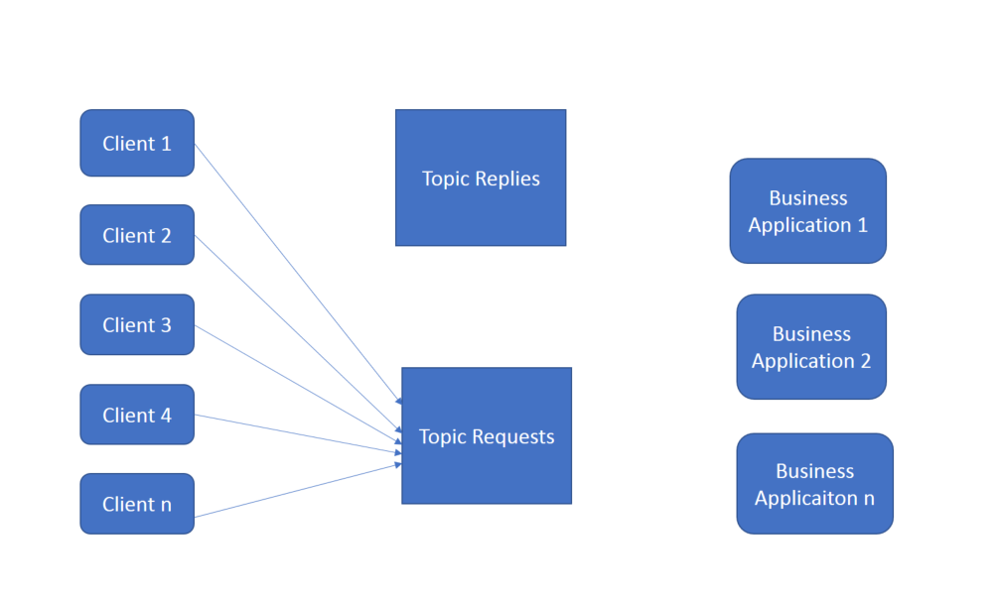

# ODM Decision Server with kafka

## Features

This sample show how to use IBM ODM with Kafka

### Workflow Description

1. We have n client application which reacte as kafka Producer and send their payload to the kafka topic named Requests

2. We have n Business Application implementing ODM Xu which reate as Consumer and execute the payload.

3. 
## Requirments

* Kafka
* IBM ODM
* Maven

## Dependencies
- Compile time
- Test
## Before starting
* Make sure you have kafka installed, start kafka by launching zookeeper and kafka-server
* Clone the project repository from github.
`$ git clone --branch=master git@github.ibm.com:MYattara/ODM-DecisionServer-J2SE-Kafka.git`
* In the pom file set the property <ibm.odm.install.dir></ibm.odm.install.dir> with your odm installation directory.

## Scenario Deployment

According to the sub-scenario we'll use one or many Client Application sending one or many payload to one or many business Application.
the client Application is a J2SE Applications which sends a payload with information about the Borrower and a Loan Request, and wait for the approval or a reject of his loan request.
The business Application is a J2SE ODM execution server in Memory application, which execute the payload against ODM loan validation sample ruleset and then return a result which should be approved or reject to J2SE Client Application
NB : The three sub-scenarios are related.

### Sub-scenario 1 : N Client Applications Sending payload to one Business Application and waiting for the result
The goal of this sub-scenario is to show that each client Application got the right answer for his payload it sent to the Business Application.

1. Create the first client Application : Open a command line in the project ODM-DecisionServer-J2SE-Kafka root folder then run the command below, it send a payload corresponding to the loan request. In this loan request the amount is 10000 and 
the yearlyIncome is 200000  : 

`$ mvn exec:java -Dexec.mainClass="odm.ds.kafka.odmj2seclient.ClientApplication" -Dexec.args="'{\"borrower\":{\"lastName\" : 
 \"Smith\",\"firstName\" : \"John\", \"birthDate\":191977200000,\"SSN\":\"800-12-0234\",\"zipCode\":\"75012\",\"creditScore\":200,
 \"yearlyIncome\":200000},\"loanrequest\":{ \"numberOfMonthlyPayments\" : 48,\"startDate\" : 1540822814178, \"amount\":10000,\"loanToValue\":1.20}}' 'localhost:9092' 
 'multipart' 'repliestest' 'test2'" -Dexec.classpathScope="test"`

 2. Create the second Client Application : Open a second command line in the root folder and run the command below. The second client Application send a loan request with a yearlyIncome 5000 and a loan amount 60000
 
`$ mvn exec:java -Dexec.mainClass="odm.ds.kafka.odmj2seclient.ClientApplication" -Dexec.args="'{\"borrower\":{\"lastName\" : 
 \"Smtih\",\"firstName\" : \"John\", \"birthDate\":191977200000,\"SSN\":\"800-12-0234\",\"zipCode\":\"75012\",\"creditScore\":200,
 \"yearlyIncome\":55000},\"loanrequest\":{ \"numberOfMonthlyPayments\" : 48,\"startDate\" : 1540822814178, \"amount\":110000,\"loanToValue\":1.20}}' 'localhost:9092' 
 'multipart' 'repliestest' 'test3'" -Dexec.classpathScope="test"`

 3. Run the Business Application :
 
`$ mvn exec:java -Dexec.mainClass="odm.ds.kafka.odmj2seclient.BusinessApplication" 
-Dexec.args="/test_deployment/loan_validation_with_score_and_grade 'localhost:9092' 'multipart' 'repliestest' 'test2'" -Dexec.classpathScope="test"
 -Dibm.odm.install.dir="C:\ODM8920" `
4. Result : 
In the fist client Application the loan request should be accepted and in the second client Application the loan request should be rejected.

### Sub-scenario 2 : N Client Applications Sending payload to N Business Applications

The goal of this sub-scenario is to show the load balancing between Business Application.

1. Run your first business Application which put it's result in out1.txt.

`$ mvn exec:java -Dexec.mainClass="odm.ds.kafka.odmj2seclient.BusinessApplication" 
-Dexec.args="/test_deployment/loan_validation_with_score_and_grade 'localhost:9092' 'multipart' 'repliestest' 'test2'" -Dexec.classpathScope="test"
 -Dibm.odm.install.dir="C:\ODM8920" `> out1.txt

2. Run your second Business Application which is going to put it's result in out2.txt

`$ mvn exec:java -Dexec.mainClass="odm.ds.kafka.odmj2seclient.BusinessApplication" 
-Dexec.args="/test_deployment/loan_validation_with_score_and_grade 'localhost:9092' 'multipart' 'repliestest' 'test2'" -Dexec.classpathScope="test"
 -Dibm.odm.install.dir="C:\ODM8920" `> out2.txt

`$ mvn exec:java -Dexec.mainClass="odm.ds.kafka.odmj2seclient.ClientMutliMessage" -Dexec.args="'{\"borrower\":{\"lastName\" : 
 \"Smtih\",\"firstName\" : \"John\", \"birthDate\":191977200000,\"SSN\":\"800-12-0234\",\"zipCode\":\"75012\",\"creditScore\":200,
 \"yearlyIncome\":55000},\"loanrequest\":{ \"numberOfMonthlyPayments\" : 48,\"startDate\" : 1540822814178, \"amount\":110000,\"loanToValue\":1.20}}' 'localhost:9092' 
 'multipart' 'repliestest' 'test3'" -Dexec.classpathScope="test"`

 
3. Run a client Application which is going to send 10 message.

4. Stop your two business Application and look at 

### Sub-scenario 3 : Availability after one Business Application has been down

## Contributing

## References
* [IBM Operational Decision Manager Developer Center](https://developer.ibm.com/odm/)
* [Java EE rule session](https://www.ibm.com/support/knowledgecenter/en/SSQP76_8.9.2/com.ibm.odm.dserver.rules.samples/res_smp_topics/smp_res_javaee.html)

## Issues and contributions

## License
[Apache 2.0](LICENSE)
## Notice
© Copyright IBM Corporation 2018.

