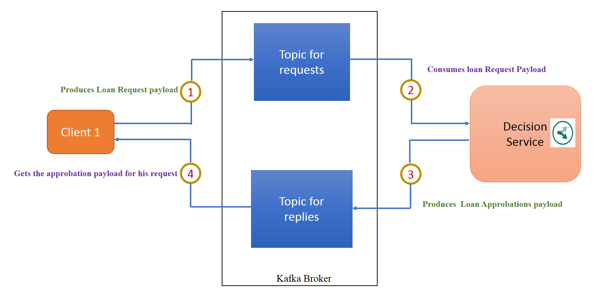

# IBM ODM Decision Server in Message-driven Architecture with Apache Kafka
[](https://github.ibm.com/MYattara/decisions-on-kafka)
[](https://opensource.org/licenses/Apache-2.0)

## Introduction

In a message-driven architecture, client applications interact with services that reply to their requests.
The advantages of message-driven architecture are asynchronous communication and the scalability with load balancing.
This type of architecture is based on a broker allowing to subscribe to a topic and publish messages.

This sample shows how to use IBM Operational Decision Manager (ODM) with Apache Kafka, which is a distributed streaming platform allowing the setup of a message driven architecture.


In the architecture of the sample, client applications send a loan request and decision services execute the loan request against a ruleset. For more information about the loan validation sample, see the References section.
There is one Kafka broker and two topics in the sample architecture.
The first topic is for client applications to put their loan request, and the second topic is for replies where the decision services put the result after executing against a ruleset.
All the decision services have the same Kafka consumer group, and client applications have different consumer groups.  


### Workflow description
The following diagram describes the workflow:



1. Client application acts as Kafka producer and sends its payload to the topic named Requests.

2. Decision service implementing ODM acts as a Kafka consumer and executes the payload.

3. After executing the payload against the ruleset, the decision service acts as a Kafka producer and puts the json result in the topic named Replies.

4. The client application acts as Kafka consumer and gets the message corresponding to the result of its request.

## Requirements

* Apache Kafka 2.11
* IBM Operational Decision Manager 8.9.2
* Apache Maven 3

## Before starting 
* Clone the project repository from github:

  ```$ git clone --branch=delivery git@github.ibm.com:MYattara/decisions-on-kafka.git```
* In the pom file, set the property `<ibm.odm.install.dir></ibm.odm.install.dir>` with your ODM installation directory. For example: `<ibm.odm.install.dir>C:\ODM8920</ibm.odm.install.dir>`

## Starting Kafka infrastructure

Starting the Kafka servers:
* Make sure that you have Kafka installed, and start Kafka by launching zookeeper and Kafka-server.

If you have a shell command line:
* Create the Kafka topic for requests: 

  ```$ Kafka-topics.sh --create --zookeeper localhost:2181 --replication-factor 1 --partitions 2 --topic requests```
* Create the Kafka topic for replies: 

  ```$ Kafka-topics.sh --create --zookeeper localhost:2181 --replication-factor 1 --partitions 2 --topic replies```


If you have a Windows command line:

* Create the Kafka topic for requests: 

  ```$ Kafka-topics.bat --create --zookeeper localhost:2181 --replication-factor 1 --partitions 2 --topic requests```
* Create the Kafka topic for replies: 

  ```$ Kafka-topics.bat --create --zookeeper localhost:2181 --replication-factor 1 --partitions 2 --topic replies```


## Building the source code
Use the following Maven command to build the source code:
`$ mvn clean install`

## Running the scenarios

In the scenario, several client applications send one or many payloads to several decision services.
The client application is a JSE application that sends a payload with information about the borrower and the loan request, and waits for the approval or rejection of the loan request.
The decision service is a JSE ODM execution server in-memory persistence application, which executes the payload against the ODM loan validation sample ruleset and returns a result (approved or rejected) to the JSE client application.

* Client application command structure: 
  ```
  $ mvn exec:java -Dexec.mainClass="odm.ds.kafka.odmjse.clientapp.ClientApplication" -Dexec.args="
  <JsonPayload> <Kafka server url> <topic for requests> <topic for replies> <number of messages>"
  -Dexec.classpathScope="test"

  ```
  `<JsonPayload>` - The loan request payload to evaluate.

  `<Kafka server URL>` - The Kafka broker URL. The sample uses `localhost:9092`. Change if necessary.

  `<topic for requests>` - The topic where the client application puts loan requests and acts as a producer, and the decision service listens to it and acts as a Kafka consumer.

  `<topic for replies>` - The topic where the decision service puts the result of the loan request execution against the decision service. The decision service acts as a producer and the client application acts as a consumer,
getting the message from the topic. 

  `<number of messages>` - The number of loan request payloads sent for execution.

* Decision service command structure: 
  ```
  $ mvn exec:java -Dexec.mainClass="odm.ds.kafka.odmjse.decisionapp.DecisionService" -Dexec.args="
  <rulesetPath> <Kafka server URL> <topic for requests> <topic for replies> <Consumer Group> " 
  -Dexec.classpathScope="test" -Dibm.odm.install.dir="C:\ODM8920" 

  ```

  `<rulesetPath>` - The IBM ODM ruleset path.

  `<Consumer Group>` - The Kafka consumer group which the decision service is part of.
-   [Scenario 1 : Two client applications sending payload to one decision service and waiting for the result](docs/chapters/subscenario1.md)
-   [Scenario 2 : Load balancing between two decision services](docs/chapters/subscenario2.md)
-   [Scenario 3 : Availability after one decision service is down](docs/chapters/subscenario3.md)

## Issues and contributions

To contribute or for any issue please use GitHub Issues tracker.

## References
* [IBM Operational Decision Manager Developer Center](https://developer.ibm.com/odm/)
* [Java EE rule session](https://www.ibm.com/support/knowledgecenter/en/SSQP76_8.9.2/com.ibm.odm.dserver.rules.samples/res_smp_topics/smp_res_javaee.html)
* [Loan Validation Sample](https://www.ibm.com/support/knowledgecenter/en/SSQP76_8.5.1/com.ibm.odm.dserver.rules.samples/designer_smp_topics/smp_rd_engineintmultproj_det.html)
* [Apache Kafka](https://kafka.apache.org/)

## License
[Apache 2.0](LICENSE)

[**Next** ](docs/chapters/subscenario1.md)
## Notice
© Copyright IBM Corporation 2018.
[](https://github.ibm.com/MYattara/decisions-on-kafka)
[](https://opensource.org/licenses/Apache-2.0)
