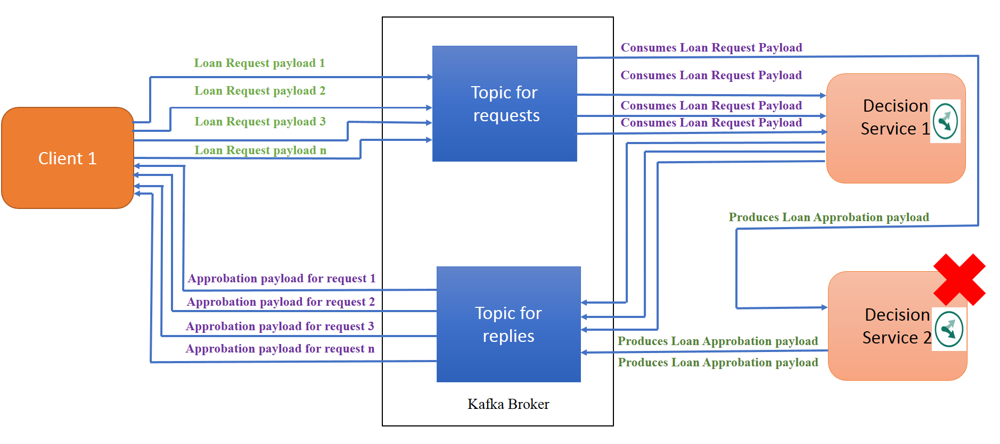

# IBM ODM Decision Server in architecture driven message with kafka
[](https://travis.ibm.com/MYattara/ODM-DecisionServer-Kafka)
[](https://github.ibm.com/MYattara/ODM-DecisionServer-Kafka)
[](https://opensource.org/licenses/Apache-2.0)

## Features


This sample show how to use IBM ODM with Kafka


### Workflow Description

Through Loan Validation sample we show how to integrate kafka with ODM.
In this sample we have Client Applications which send the loan request and Business Applications which execute the loan request against a ruleset, for more details about the loan Validation sample see References section.
In the Sample architecture we have 1 kafka broker, two topics, the first topic is where Client applications put their Loan request and the second topic is for replies where the Business Applications put the result after
execution against ODM ruleset. All the Business Applications have the same kafka Consumer Group, and Client Applications have different Consumer Group.  

1. N Client applications which react as kafka Producer and send their payload to the kafka topic named Requests

2. M Business Applications implementing ODM which react as Consumer and execute the payload.

3. After executed the payload against the ruleset the Bussiness Applications react as a Kafka producer and put the json result in the topic Replies.

4. The Client Applications react as Kafka Consumer and got the message corresponding to the result of his request.

## Requirments

* Kafka
* IBM ODM
* Maven

## Before starting
* Make sure you have kafka installed, start kafka by launching zookeeper and kafka-server.
* Clone the project repository from github.
`$ git clone --branch=odm-integration git@github.ibm.com:MYattara/ODM-DecisionServer-JSE-Kafka.git`
* In the pom file set the property <ibm.odm.install.dir></ibm.odm.install.dir> with your odm installation directory, example <ibm.odm.install.dir>C:\ODM8920</ibm.odm.install.dir>

If you have a shell command line
* Create the kafka topic for request : `$ kafka-topics.sh --create --zookeeper localhost:2181 --replication-factor 1 --partitions 2 --topic requests`
* Create the kafka topic for replies : `$ kafka-topics.sh --create --zookeeper localhost:2181 --replication-factor 1 --partitions 2 --topic replies`


If you have windows command line

* Create the kafka topic for request : `$ kafka-topics.bat --create --zookeeper localhost:2181 --replication-factor 1 --partitions 2 --topic requests`
* Create the kafka topic for replies : `$ kafka-topics.bat --create --zookeeper localhost:2181 --replication-factor 1 --partitions 2 --topic replies`


## Building
Use the following maven command to build the source code.
`$ mvn clean install`

## Scenario Running

According to the sub-scenario we'll use several Client Applications sending one or many payload to several Business Applications.
the Client Application is a JSE Applications whi00ch sends a payload with information about the Borrower and a Loan Request, and wait for the approval or a reject of his loan request.
The Business Application is a JSE ODM execution server in Memory application, which execute the payload against ODM loan validation sample ruleset and then returns a result which should be approved or reject to JSE Client Application.

### Sub-scenario 1 : 2 Client Applications Sending payload to 1 Business Application and waiting for the result.
The goal of this sub-scenario is to show that each client Application got the right answer for his payload it sent to the Business Application.


* Client Application command structure : 
```
$ mvn exec:java -Dexec.mainClass="odm.ds.kafka.odmjse.clientapp.ClientApplication" -Dexec.args="
<JsonPayload> <kafka server url> <topic for requests> <topic for replies> <number of message>"
 -Dexec.classpathScope="test"

```
* Business Application command structure : 
```
$ mvn exec:java -Dexec.mainClass="odm.ds.kafka.odmjseclient.BusinessApplication" -Dexec.args="
<rulesetPath> <kafka server url> <topic for requests> <topic for replies> <Consumer Group> " 
-Dexec.classpathScope="test" -Dibm.odm.install.dir="C:\ODM8920" 

* In the sample we use as serverul localhost:9092 if yours is different please change it, 
 ```

1. Create the first Client Application : Open a command line in the project ODM-DecisionServer-JSE-Kafka root folder then run the command below, it sends a payload corresponding to the loan request. In this loan request the amount is 10000 and 
the yearlyIncome is 200000. 

`$ mvn exec:java -Dexec.mainClass="odm.ds.kafka.odmjse.clientapp.ClientApplication" -Dexec.args="'{\"borrower\":{\"lastName\" : \"Smith\",\"firstName\" : \"Alice\", \"birthDate\":191977200000,\"SSN\":\"800-12-0234\",\"zipCode\":\"75012\",\"creditScore\":200,\"yearlyIncome\":200000},
\"loanrequest\":{ \"numberOfMonthlyPayments\" : 48,\"startDate\" : 1540822814178, \"amount\":10000,\"loanToValue\":1.20}}' 'localhost:9092' 'requests' 'replies'" -Dexec.classpathScope="test"`

'localhost:9092' is the broker url, if your broker url is different please change it,'requests' corresponds to the topic where loan requests are put,  'requests' the topic where the Business Application put the execution
result: 

 2. Create the second Client Application : Open a second command line in the root folder and run the command below. The second client Application send a loan request with a yearlyIncome 5000 and a loan amount 60000
 
`$ mvn exec:java -Dexec.mainClass="odm.ds.kafka.odmjse.clientapp.ClientApplication" -Dexec.args="'{\"borrower\":{\"lastName\" :\"Doe\",\"firstName\" : \"John\", \"birthDate\":191977200000,\"SSN\":\"800-12-0234\",\"zipCode\":\"75012\",\"creditScore\":200,
 \"yearlyIncome\":55000},\"loanrequest\":{ \"numberOfMonthlyPayments\" : 48,\"startDate\" : 1540822814178, \"amount\":110000,\"loanToValue\":1.20}}' 'localhost:9092' 'requests' 'replies' 'baconsumegroup' 1" -Dexec.classpathScope="test"`

  'baconsumegroup' the consumer group in which Business Applications are gathered.
 3. Run the Business Application :
 
`$ mvn exec:java -Dexec.mainClass="odm.ds.kafka.odmjse.businessapp.BusinessApplication" -Dexec.args="/test_deployment/loan_validation_with_score_and_grade 'localhost:9092' 'requests' 'replies' 'test2'" -Dexec.classpathScope="test" -Dibm.odm.install.dir="C:\ODM8920" `
 
 
4. Result : 
In the fist Client Application the loan request should be accepted and in the second Client Application the loan request should be rejected.

5. Stop the Business Application before starting the Sub-scenario 2

### Sub-scenario 2 :  1 Client Application Sending several payload to N Business Applications


The goal of this sub-scenario is to show the load balancing between Business Application.


1. Run your first Business Application which put it's result in out1.txt.

`$ mvn exec:java -Dexec.mainClass="odm.ds.kafka.odmjse.businessapp.BusinessApplication" -Dexec.args="/test_deployment/loan_validation_with_score_and_grade 'localhost:9092' 'requests' 'replies' 'test2'" -Dexec.classpathScope="test"
 -Dibm.odm.install.dir="C:\ODM8920" > out1.txt `

2. Run your second Business Application which is going to put it's result in out2.txt

`$ mvn exec:java -Dexec.mainClass="odm.ds.kafka.odmjse.businessapp.BusinessApplication" -Dexec.args="/test_deployment/loan_validation_with_score_and_grade 'localhost:9092' 'requests' 'replies' 'test2'" -Dexec.classpathScope="test"
 -Dibm.odm.install.dir="C:\ODM8920" > out2.txt`
 
3. Run a client Application which is going to send 7 messages.

`$ mvn exec:java -Dexec.mainClass="odm.ds.kafka.odmjse.clientapp.ClientApplication" -Dexec.args="'{\"borrower\":{\"lastName\" : \"Smtih\",\"firstName\" : \"John\", \"birthDate\":191977200000,\"SSN\":\"800-12-0234\",\"zipCode\":\"75012\",\"creditScore\":200,
 \"yearlyIncome\":55000},\"loanrequest\":{ \"numberOfMonthlyPayments\" : 48,\"startDate\" : 1540822814178, \"amount\":110000,\"loanToValue\":1.20}}' 'localhost:9092' 'requests' 'replies' 'test3' 7 " -Dexec.classpathScope="test"`

4. Stop your two Business Application and look at the files out1.txt and out2.txt you will see that the seven payloads have been split between for execution between the two Business Applications.

### Sub-scenario 3 : Availability after one Business Application has been down
The goal of this subscenario is to see that if one Business Application broke, we'll still have the others working



1. Run your first Business Application which put it's result in out1.txt.

`$ mvn exec:java -Dexec.mainClass="odm.ds.kafka.odmjse.businessapp.BusinessApplication" 
-Dexec.args="/test_deployment/loan_validation_with_score_and_grade 'localhost:9092' 'requests' 'replies' 'test2'" -Dexec.classpathScope="test" -Dibm.odm.install.dir="C:\ODM8920" > out1.txt`

2. Run your second Business Application which is going to put it's result in out2.txt

`$ mvn exec:java -Dexec.mainClass="odm.ds.kafka.odmjse.businessapp.BusinessApplication" -Dexec.args="/test_deployment/loan_validation_with_score_and_grade 'localhost:9092' 'requests' 'replies' 'test2'" -Dexec.classpathScope="test"
 -Dibm.odm.install.dir="C:\ODM8920" > out2.txt`
 
3. Run a Client Application which is going to send 10 messages.

`$ mvn exec:java -Dexec.mainClass="odm.ds.kafka.odmjse.clientapp.ClientApplication" -Dexec.args="'{\"borrower\":{\"lastName\" : \"Smtih\",\"firstName\" : \"John\", \"birthDate\":191977200000,\"SSN\":\"800-12-0234\",\"zipCode\":\"75012\",\"creditScore\":200,
 \"yearlyIncome\":55000},\"loanrequest\":{ \"numberOfMonthlyPayments\" : 48,\"startDate\" : 1540822814178, \"amount\":110000,\"loanToValue\":1.20}}' 'localhost:9092' 'requests' 'replies' 'test3' 10" -Dexec.classpathScope="test"`
 
4. Stop one of your Business Appplication

5. Create a new Client Application which will send 5 messages. We'll see that the remaining Business Application will handle the request :
`$ mvn exec:java -Dexec.mainClass="odm.ds.kafka.odmjse.clientapp.ClientApplication" -Dexec.args="'{\"borrower\":{\"lastName\" : \"Smtih\",\"firstName\" : \"John\", \"birthDate\":191977200000,\"SSN\":\"800-12-0234\",\"zipCode\":\"75012\",\"creditScore\":200,
 \"yearlyIncome\":55000},\"loanrequest\":{ \"numberOfMonthlyPayments\" : 48,\"startDate\" : 1540822814178, \"amount\":110000,\"loanToValue\":1.20}}' 'localhost:9092' 'requests' 'replies' 'test3' 5" -Dexec.classpathScope="test"`

## Issues and contributions

To contribute or for any issue please use GitHub Issues tracker.

## References
* [IBM Operational Decision Manager Developer Center](https://developer.ibm.com/odm/)
* [Java EE rule session](https://www.ibm.com/support/knowledgecenter/en/SSQP76_8.9.2/com.ibm.odm.dserver.rules.samples/res_smp_topics/smp_res_javaee.html)
* [Loan Validation Sample](https://www.ibm.com/support/knowledgecenter/en/SSQP76_8.5.1/com.ibm.odm.dserver.rules.samples/designer_smp_topics/smp_rd_engineintmultproj_det.html)

## License
[Apache 2.0](LICENSE)
## Notice
© Copyright IBM Corporation 2018.

[](https://travis.ibm.com/MYattara/ODM-DecisionServer-Kafka)
[](https://github.ibm.com/MYattara/ODM-DecisionServer-Kafka)
[](https://opensource.org/licenses/Apache-2.0)

