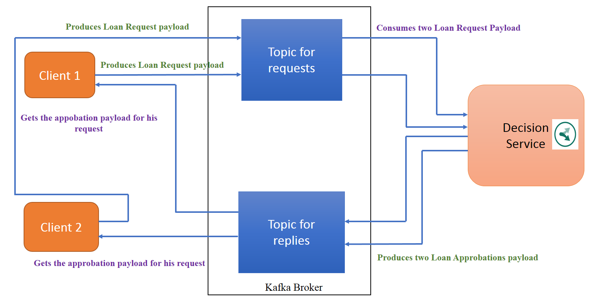

## Scenario 1 : Two client applications sending payload to one decision service and waiting for the result
The goal of this scenario is to show that each client application gets the right answer for the payload it sends to the decision service.

 

1. Create the first client application: Open a command line in the root folder of the ODM-DecisionServer-JSE-Kafka project, and then run the command below. It sends a payload corresponding to the loan request. In this request, the amount is 10000 and 
the yearly income is 200000. 

    `
$ mvn exec:java -Dexec.mainClass="odm.ds.kafka.odmjse.clientapp.ClientApplication" -Dexec.args="'{\"borrower\":{\"lastName\" :\"Smith\",\"firstName\" : \"Alice\", \"birthDate\":191977200000,\"SSN\":\"800-12-0234\",\"zipCode\":\"75012\",\"creditScore\":200,
 \"yearlyIncome\":200000},\"loanrequest\":{ \"numberOfMonthlyPayments\" : 48,\"startDate\" : 1540822814178, \"amount\":110000,\"loanToValue\":1.20}}' 'localhost:9092' 'requests' 'replies' 1" -Dexec.classpathScope="test"
    `
'localhost:9092' is the broker url. Change it as needed.
'requests' corresponds to the topic where loan requests are put.
'replies' corresponds to the topic where the decision service puts the execution result.
1 is the number of loan request that the client application sends to the decision service.

 2. Create the second client application: Open a second command line in the root folder, and then run the following command. The second client application sends a loan request with a yearly income of 55000 and the amount of loan 110000.
 
    `
$ mvn exec:java -Dexec.mainClass="odm.ds.kafka.odmjse.clientapp.ClientApplication" -Dexec.args="'{\"borrower\":{\"lastName\" :\"Doe\",\"firstName\" : \"John\", \"birthDate\":191977200000,\"SSN\":\"800-12-0234\",\"zipCode\":\"75012\",\"creditScore\":200,
 \"yearlyIncome\":55000},\"loanrequest\":{ \"numberOfMonthlyPayments\" : 48,\"startDate\" : 1540822814178, \"amount\":110000,\"loanToValue\":1.20}}' 'localhost:9092' 'requests' 'replies' 1" -Dexec.classpathScope="test"
    `

 3. Run the decision service:

    `
$ mvn exec:java -Dexec.mainClass="odm.ds.kafka.odmjse.decisionapp.DecisionService" -Dexec.args="/test_deployment/loan_validation_with_score_and_grade 'localhost:9092' 'requests' 'replies' 'baconsumegroup'" -Dexec.classpathScope="test"
    `
    
    'baconsumegroup' is the consumer group that the decision service is part of.

 
4. Result: 
The loan request should be accepted in the first client application, and it should be rejected in the second client application.

5. Stop the decision service before starting scenario 2.

[**Next** ](../../docs/chapters/subscenario2.md)

[ **Back to home page**](../../Readme.md)
