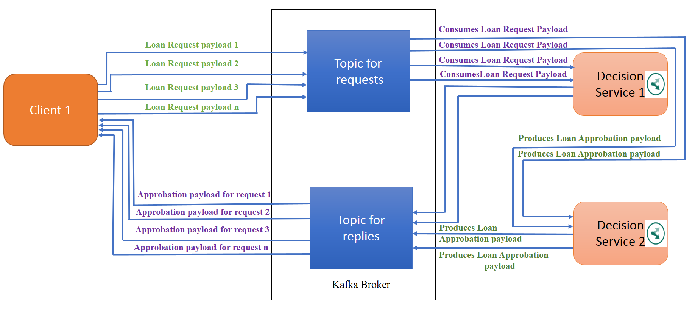

## Scenario 2 :  Load balancing between two Decision Services

The goal of this sub-scenario is to show the load balancing between two Decision Services.

1. Run your first Decision Service that puts its result in out1.txt.

`$ mvn exec:java -Dexec.mainClass="odm.ds.kafka.odmjse.businessapp.DecisionService" -Dexec.args="/test_deployment/loan_validation_with_score_and_grade 'localhost:9092' 'requests' 'replies' 'test2'" -Dexec.classpathScope="test"
 -Dibm.odm.install.dir="C:\ODM8920" > out1.txt `

2. Run your second Decision Service that puts its result in out2.txt

`$ mvn exec:java -Dexec.mainClass="odm.ds.kafka.odmjse.businessapp.DecisionService" -Dexec.args="/test_deployment/loan_validation_with_score_and_grade 'localhost:9092' 'requests' 'replies' 'test2'" -Dexec.classpathScope="test"
 -Dibm.odm.install.dir="C:\ODM8920" > out2.txt`
 
3. Run a client Application that will send seven messages.

`$ mvn exec:java -Dexec.mainClass="odm.ds.kafka.odmjse.clientapp.ClientApplication" -Dexec.args="'{\"borrower\":{\"lastName\" : \"Smtih\",\"firstName\" : \"John\", \"birthDate\":191977200000,\"SSN\":\"800-12-0234\",\"zipCode\":\"75012\",\"creditScore\":200,
 \"yearlyIncome\":55000},\"loanrequest\":{ \"numberOfMonthlyPayments\" : 48,\"startDate\" : 1540822814178, \"amount\":110000,\"loanToValue\":1.20}}' 'localhost:9092' 'requests' 'replies' 7 " -Dexec.classpathScope="test"`

4. When the Client Application terminates and the Decision Services are displaying the message "waiting for payload" stop both of your Decision Services and look at the files out1.txt and out2.txt. You will see that the seven payloads have been split for execution between these two Decision Services.

[**Next** ](../../docs/chapters/subscenario3.md)

[ **Back to home page**](../../Readme.md)